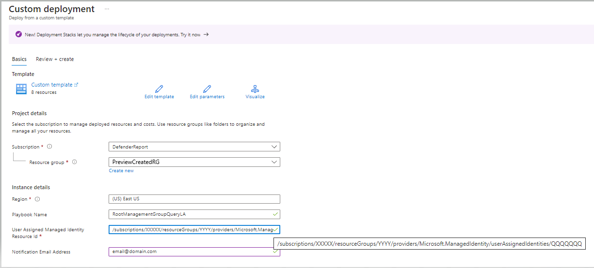

# Identifying Subscriptions that are not Managed by Microsoft Defender for Cloud and send email with Outlook.com
**Author of the original code: Safeena Begum**
**Author of the change code: Edson Matias Fagundes Junior**

This is a script originaly created by Safeena Begum, and customized and upgraded by me for learning propose and without any financial interest, you can use this free code to if you need withou any financial interested. 

The proposal of this code is fix some of the issues that i face during the deployment of the original report that you can find on this link https://github.com/Azure/Microsoft-Defender-for-Cloud/tree/main/Workflow%20automation/SubscriptionManagement.

## Those are the issues, that I tried to fix for my needs:
    Not working  if you don't have O365
        - Changing the Connector from O365 to Outlook.com
    Not working for childrens subscription of childrens Management group.
        - Changing the expression on **Item Parent Count**  to execute when Greater or equal 1 on the first **Condition** 
    Fixing the ARM_1 over that does not exist. 

## Prerequistes and Step by Step Deployment:

**A.** Create a resource group 

**B.** Create User Assigned Managed Identity. Follow the instructions listed in the doc to [create user-assigned managed identity](https://docs.microsoft.com/en-us/azure/active-directory/managed-identities-azure-resources/how-to-manage-ua-identity-portal#create-a-user-assigned-managed-identity). 
    **Copy the Resource ID you will need for the deployment**

**C.** On this step I had some issues that by default you dont have that permission and you need to elevate your permission to add the Managed identity permisson on Management group Root Level, remeber its important to be on Root Level. [Elevate Access Global Admin](https://learn.microsoft.com/en-us/azure/role-based-access-control/elevate-access-global-admin)

**C.1.** Once user-assgined managed identity is created, make sure to provide Reader Permissions to the Root Management Group, folowing the below steps.

  

Select **"Reader"** click on **next**.  
On the next screen click on **Managed Identiy** and **Select the members**.

After that Click on  **Review + assing**.
   
**D.** Now you can deploy :D

This is how the deployment screen looks like. 

**After the deploy do the followign steps**

**E.** Enable and add the above created User assigned Identity to the Logic App (Remember to assing on the 2 Logic apps.).  Follow the instructions [here](https://docs.microsoft.com/en-us/azure/logic-apps/create-managed-service-identity#create-user-assigned-identity-in-the-azure-portal) to assign the User assigned identity to the Logic App. 

**F.** Make sure to authorize the Outlook API connection
    This API connection is used to send emails. To authorize the API connection:
        - Go to the Resource Group you have used to deploy the template resources.
        - Select the Outlook API connection and press 'Edit API connection'.
        - Press the 'Authorize' button.
        - Make sure to authenticate against the poperly Outlook.com account.
        - Press 'Save'.
**G.** Make sure to authorize the ARM API connection
    This API connection is used to Manage the resources. To authorize the API connection:
        - Go to the Resource Group you have used to deploy the template resources.
        - Select the ARM API connection and press 'Edit API connection'.
        - Press the 'Authorize' button.
        - Make sure to authenticate against the poperly account.
        - Press 'Save'.  
    In my case I created one account that I use to authorize the ARM api and for that account need to assing the Logic App Operator role.
     

**H.** Make sure to authorize the AzureTables API connection
    This API connection is used to connect with storage Account. To authorize the API connection:
        - Go to the Resource Group you have used to deploy the template resources.
        - Select the AzureTables API connection and press 'Edit API connection'.
        - Insert the Storage Account Name and Key.
        - Press 'Save'.

## How it works: 
By default this automation runs weekly and queries the Root Management group to identify any new subscription(s) that are directly assigned to the root management group. 
If one or more subscriptions are found in the Management group tree, the Logic App will send an email with the following details: Subscription Name, Subscription ID, Action, Status of the subscription (If MDC is enabled or disabled). Below has an example of how this email look like:
 
If you just add one new subscription and run try to run the logic app porbably will fail as it needs Resource provider status registered for Microsoft.security. [Here](https://learn.microsoft.com/en-us/answers/questions/1251839/how-to-register-subscription-to-microsoft-security)
The automation artifact also creates a Storage account with a table storage in it during the deployment of the template. If the intent of assigning the subscription to the management group was on purpose, you could exclude the subscription from being displayed in the email on next run by just clicking on the hyperlink ‘Exclude <subscriptionname>’ under the Action column of Image 1. 
In the next run (weekly) it will not display the subscriptions you added to the Exclusion list (table storage) and notifies only newly added subscription(s) via email. 

***

You can deploy the main template by clicking on the buttons below:

 

***
Check out this [blog](https://techcommunity.microsoft.com/t5/azure-security-center/identifying-subscriptions-that-are-not-managed-by-azure-security/ba-p/2111408) to understand more about the automation and for step by step instructions. 

# Acknowledgements
Thanks to Nicholas DiCola & Gilad Elyashar for this wonderful automation idea, and Safeena Begum for the main code!  
